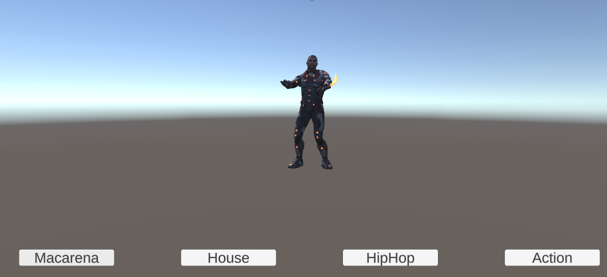
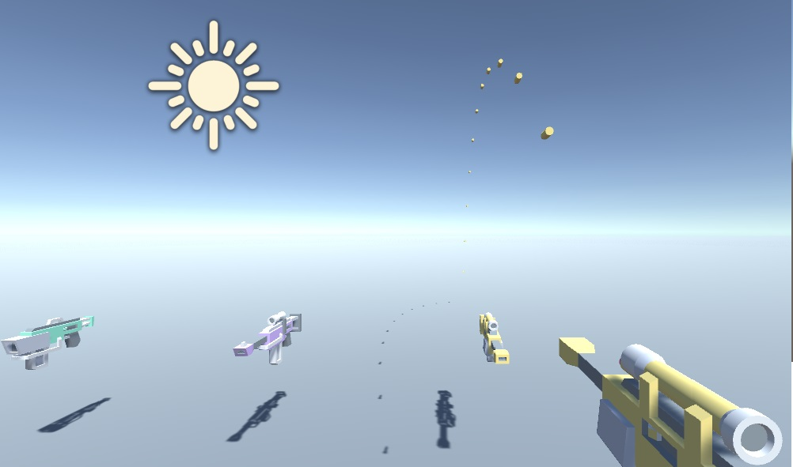

# PrueabTecnica Unity3D

</img>

</img>
Esta es una prueba técnica que consiste en la creación de 2 escenas usando Unity3D versión 2020.3.14f1.

## Características 📋

### Escena 1
- Cuenta interfas de usuario con 4 botones, 3 de los cuales activa una animación concreta mientras el ultimo realiza un cambio de escena.

### Escena 2
- Existen 3 armas previamente cargadas en el mundo
- Al interactuar con cada una de ellas se asigna al jugador.
- Cada arma dispara un tipo de proyectil con un comportamiento diferente.

## Instalación y Uso 🛠️

1. Clona el repositorio en tu máquina local:

   ```bash
   git clone https://github.com/danielmaavre/PruebaTecnica.git

2. Abre el proyecto en Unity (recomendado usar la versión 2020.3 o superior).

    Ejecuta la escena principal para comenzar a jugar.

3. Uso 🕹️

- Movimiento: Usa las teclas de flechas o WASD para mover al personaje.
- Disparo: Barra espaciadora.


## Notas 📌

De momento no se cuenta con las funcionalidades del arma gravitatoria, la configuración de armas por medio de Scriptable Objects ni la visualización de la animación en la segunda escena.